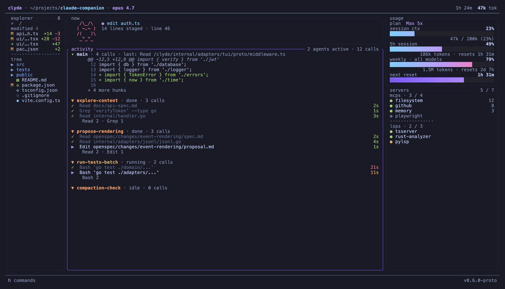

# Clyde

[](https://github.com/Systemartis/clyde/actions/workflows/ci.yml)
[](https://securityscorecards.dev/viewer/?uri=github.com/Systemartis/clyde)
[](https://goreportcard.com/report/github.com/Systemartis/clyde)
[](https://pkg.go.dev/github.com/Systemartis/clyde)
[](LICENSE)

> Claude's best friend.

A terminal companion for Claude Code. Tile it next to your `claude` pane in tmux/cmux/Ghostty and see live sessions, tool activity, token usage, todos, subagents, and project state — all without leaving the terminal.

<p align="center">
  
  <br>
  <em>clyde --demo — the 3-column dashboard, help overlay, and active-mode scrolling. Recorded with <a href="https://github.com/charmbracelet/vhs">VHS</a> from <a href="assets/tapes/demo.tape">this tape</a>.</em>
</p>

## Status

**V1 shipped.** Full multi-panel TUI: now panel (current tool + mascot), calls panel (agent hierarchy), usage panel (tokens + cost), diff panel (git hunks), explorer panel (filesystem tree), servers panel (MCPs + LSPs), notification banner (hook permission requests). Three layout modes: stack, tabs, multi-col. Tokyo Night theme, configurable via `~/.config/clyde/config.toml`.

Built spec-first using **SDD** (Spec-Driven Development), **DDD**, and **Hexagonal Architecture**. Tests come before code. Architectural layering is enforced at lint-time via golangci-lint depguard rules.

## Install

### One-liner installer (recommended)

```sh
curl -fsSL https://raw.githubusercontent.com/Systemartis/clyde/main/install.sh | sh
```

Detects your OS + arch, fetches the matching archive, verifies the cosign keyless signature (if `cosign` is on `$PATH`), checks the sha256 against `checksums.txt`, and drops the binary into `$HOME/.local/bin`. Override with `INSTALL_DIR=...` or pin a specific tag with `VERSION=v0.1.0` (see comments at the top of [`install.sh`](install.sh)).

If you don't have `cosign` installed yet, you'll get a warning that the install proceeded with sha256 verification only. For full supply-chain verification install cosign first (`brew install cosign` / [other paths](https://github.com/sigstore/cosign#installation)) and re-run.

### Pre-built binaries (manual)

Each release ships a `tar.gz` for `linux/{amd64,arm64}` and `darwin/{amd64,arm64}` plus a `checksums.txt`, an SPDX SBOM per archive, and a cosign signature. See [SUPPLY_CHAIN.md](SUPPLY_CHAIN.md) for the full verify recipe.

```sh
VERSION=0.1.0
OS=$(uname -s | tr '[:upper:]' '[:lower:]')
ARCH=$(uname -m | sed 's/x86_64/amd64/;s/aarch64/arm64/')
curl -fsSL "https://github.com/Systemartis/clyde/releases/download/v${VERSION}/clyde_${VERSION}_${OS}_${ARCH}.tar.gz" \
  | tar -xz -C /tmp clyde
install -m 0755 /tmp/clyde "$HOME/.local/bin/clyde"   # or anywhere on $PATH
clyde --version
```

### Build from source (`go install`)

Requires Go 1.26+:

```sh
go install github.com/Systemartis/clyde/cmd/clyde@latest
```

The binary lands at `$(go env GOPATH)/bin/clyde` (typically `~/go/bin/clyde`). If `~/go/bin` is on your `$PATH`, you're done. Otherwise:

```sh
# Option 1 — add ~/go/bin to PATH permanently (zsh)
echo 'export PATH="$HOME/go/bin:$PATH"' >> ~/.zshrc

# Option 2 — symlink into a directory already in your PATH
ln -sf "$(go env GOPATH)/bin/clyde" ~/.local/bin/clyde
```

Verify with `which clyde && clyde --version`.

### Windows

There are no native Windows builds yet. Use the `linux/amd64` build under WSL2 — clyde reads `~/.claude` inside the WSL filesystem, so run Claude Code from the same WSL environment.

## Usage

```sh
cd /path/to/your/project        # any directory where you run Claude Code
clyde                           # tile this in a side pane next to `claude`
clyde --demo                    # try it in 10 seconds: deterministic mock data, no live reads
```

| Flag | Default | What it does |
|------|---------|--------------|
| `--demo` | off | Run against deterministic mock data — no live reads, no hook server. Good for a first look and for reproducing UI bugs. |
| `--layout` | from config | Override the layout mode for this run: `stack`, `tabs`, or `multi-col`. |
| `--source` | `claude` | LLM source adapter. Only `claude` ships today; `gemini`/`codex`/`kimi` are planned. |
| `--version` | — | Print the version and exit. |
| `--crash-report` | — | Bundle the log, version, and environment into a tarball at `~/clyde-crash-<timestamp>.tar.gz` for bug reports, then exit. |

Clyde reads real Claude Code session data from `~/.claude/projects/<encoded-cwd>/*.jsonl`. It detects sessions for the current working directory; the encoding follows Claude Code's scheme (any non-alphanumeric character → `-`).

If clyde shows no sessions: confirm you have run `claude` in this directory at least once (which creates the corresponding `~/.claude/projects/<encoded-cwd>/` directory). Per-project scope means clyde is intentionally local to the cwd it's launched from.

### Plan usage & credentials

On a Pro/Max subscription, the usage panel shows the **same 5-hour and weekly percentages as claude.ai/settings/usage**. To do that, clyde reads the OAuth token Claude Code already stored locally (the macOS Keychain, or Claude Code's credentials file on Linux) and calls the same usage endpoint Claude Code uses. Clyde never writes or modifies credentials.

- On macOS the first live run may show a **Keychain access prompt** — that's clyde reading Claude Code's existing token. Click "Deny" and clyde still works: the plan bars fall back to a time-elapsed approximation derived from your local session files, marked `(plan offline)`.
- API-key users (no subscription) see a `$` cost figure instead of plan bars — per-token cost is the meaningful number there.

### Diagnostics

Clyde logs JSON records to `~/.cache/clyde/clyde.log` (or `$XDG_CACHE_HOME/clyde/clyde.log`). Set `CLYDE_DEBUG=1` to raise the level to debug. When reporting a bug, attach the tarball produced by `clyde --crash-report` — it contains the log, version, and environment, and nothing else.

## Hook notifications

Clyde can surface Claude Code's **permission requests** as a notification you answer with one keypress — approve or deny tools without switching panes.

How it works: in live mode clyde starts a localhost-only HTTP server on a random free port and writes its URL (which embeds a per-run auth token) to `~/.cache/clyde/hook-url` (mode 0600). A `PreToolUse` hook in Claude Code POSTs each pending tool call to that URL and blocks until you respond.

Add this to `~/.claude/settings.json` (merge with any existing `hooks` block):

```json
{
  "hooks": {
    "PreToolUse": [
      {
        "matcher": "*",
        "hooks": [
          {
            "type": "command",
            "command": "curl -fsS -m 290 -X POST -H 'Content-Type: application/json' -d @- \"$(cat \"${XDG_CACHE_HOME:-$HOME/.cache}\"/clyde/hook-url)\""
          }
        ]
      }
    ]
  }
}
```

Because the command reads `hook-url` at call time, it always finds the current port — no settings edit needed when clyde restarts. `clyde setup` prints this snippet plus your resolved hook-url path on plain stdout.

In the notification: **y** approves, **n** denies, **Esc** denies and dismisses. The design fails closed: if clyde isn't running (curl fails, the hook errors) Claude Code proceeds with its own normal permission prompt, and if clyde's queue is full the call is denied with a retry message rather than silently approved. Pending hooks are auto-denied when you quit clyde.

## Configuration

The global config lives at `~/.config/clyde/config.toml`. Everything is optional — built-in defaults apply, then the global file, then a per-project override section. Most settings can also be changed live from the settings overlay (`?`), and persist back to this file.

```toml
[layout]
default_mode = "stack"            # stack | tabs | multi-col
auto_switch_threshold = 80        # below this terminal width, force stack
cycle_hotkey = "ctrl+l"

# One block per panel: now, calls, diff, usage, explorer, servers, bash, cache.
# position orders panels in the stack; height (optional) pins a row count.
[panels.now]
enabled = true
default_collapsed = false
position = 1

[panels.calls]                    # the "activity" panel
enabled = true
default_collapsed = true
position = 2

[panels.diff]
enabled = false                   # off by default — hunks show inline in activity
default_collapsed = true
position = 3

[panels.bash]                     # opt-in: session-wide bash command ledger
enabled = false

[panels.cache]                    # opt-in: prompt-cache efficiency dashboard
enabled = false

auto_switch_to_all_on_new_session = true   # jump to the Σ tab when a new session appears
remember_layout = false           # persist collapse/resize changes across runs
notification_style = "fullscreen" # fullscreen | banner | off
notify_cost_threshold_usd = 20.0  # 0 disables cost alerts (plan-quota alerts still fire)
theme = "tokyo-night"             # tokyo-night | catppuccin | dracula | gruvbox | nord | rose-pine | kanagawa
mascot_persona = "meowl"          # meowl | bowl | off
boot_screen_enabled = true

# Per-project overrides (applied last, keyed by absolute cwd).
[projects."/Users/you/work/api".panels]
diff = true
bash = true
```

### Keybindings

| Key | Action |
|-----|--------|
| `Tab` / `Shift+Tab` | Cycle panel focus |
| `↑` / `↓` | Navigate panels (scroll, in active mode) |
| `Enter` | Enter active mode on the focused panel (scrollable, pink border) |
| `Esc` | Leave active mode / dismiss overlays |
| `Space` | Collapse focused panel |
| `+` / `-` | Resize panel (active mode) |
| `Ctrl+L` | Cycle layout mode (stack → tabs → multi-col) |
| `Ctrl+E` / `Ctrl+A` / `Ctrl+D` | Jump to explorer / activity / diff |
| `Ctrl+0` | Collapse every panel except the focused one |
| `h` | Per-panel help overlay |
| `?` | Settings overlay |
| `q` / `Ctrl+C` | Quit |

The mouse works too: click to focus, double-click for active mode, wheel to scroll the panel under the cursor, click a panel's top border to collapse it.

## Stack

- **Go** + [`charm.land/bubbletea/v2`](https://charm.land) + `lipgloss/v2` — single static binary.
- **Hexagonal layering**: `internal/domain` (pure stdlib) / `internal/application` (use cases) / `internal/ports` (interfaces) / `internal/adapters/*` (see the directory — every adapter is wired in `cmd/clyde/main.go`).
- **Strict TDD**: failing test → implement → green → refactor. Domain and application use table-driven tests; TUI uses `teatest/v2` golden snapshots.
- **Lint enforcement**: `golangci-lint` `depguard` rules in `.golangci.yml` reject layering violations (domain → adapters/UI, application → adapters, ports → adapters).

## Development

```sh
go test ./...                 # unit + integration tests
go test -cover ./...          # with coverage
go vet ./...                  # static checks
gofmt -l .                    # formatting (no diff = clean)
golangci-lint run ./...       # lint + hexagonal layer enforcement
go build ./cmd/clyde          # local build
```

## Uninstall

```sh
rm "$(which clyde)"                                  # the binary (~/.local/bin/clyde or ~/go/bin/clyde)
rm -rf ~/.cache/clyde                                # log + hook-url (or $XDG_CACHE_HOME/clyde)
rm -rf ~/.config/clyde                               # config.toml
```

If you added the hook snippet, also remove the clyde entry from `hooks.PreToolUse` in `~/.claude/settings.json`.

## Security

Found a vulnerability? Please **don't** open a public issue. See [SECURITY.md](SECURITY.md) for the disclosure process and trust model. Each tagged release ships SPDX SBOMs and a keyless cosign signature over `checksums.txt` — verify before running.

## Contributing

See [CONTRIBUTING.md](CONTRIBUTING.md) for the local-dev setup, the strict-TDD requirement, and the conventional-commits + branch-naming rules.

## Governance

[GOVERNANCE.md](GOVERNANCE.md) describes how decisions get made and who holds the keys; [MAINTAINERS.md](MAINTAINERS.md) lists the current crew.

## License

Open source under the **MIT License** — see [LICENSE](LICENSE). Copyright © 2026 Systemartis, Vlad Popescu-Bejat, Maxim Tudor Maicovschi. Free to use, modify, and redistribute; attribution required per the license terms.

## Trademarks

**Clyde** and the visual identity are trademarks of [Systemartis](https://systemartis.com). The MIT license covers the source code; it does not grant rights to the name or branding. Forks are welcome — please pick a different name.

**Claude** and **Claude Code** are trademarks of [Anthropic, PBC](https://www.anthropic.com). This project is not affiliated with, endorsed by, or sponsored by Anthropic. Clyde is a third-party companion that reads files Claude Code writes locally; it is not a client of any Anthropic API on its own (the optional plan-usage check uses the same credentials Claude Code already wrote to your Keychain).
