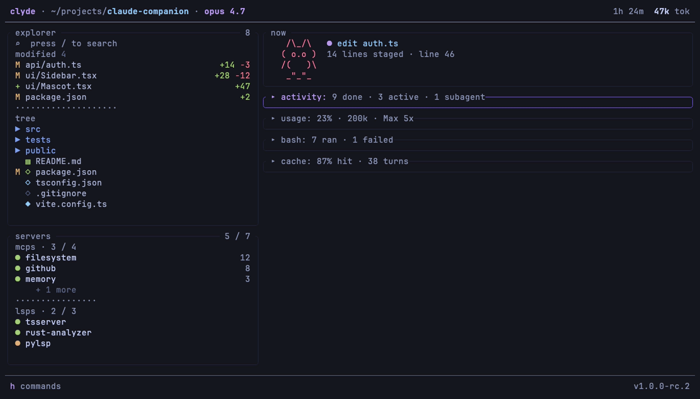
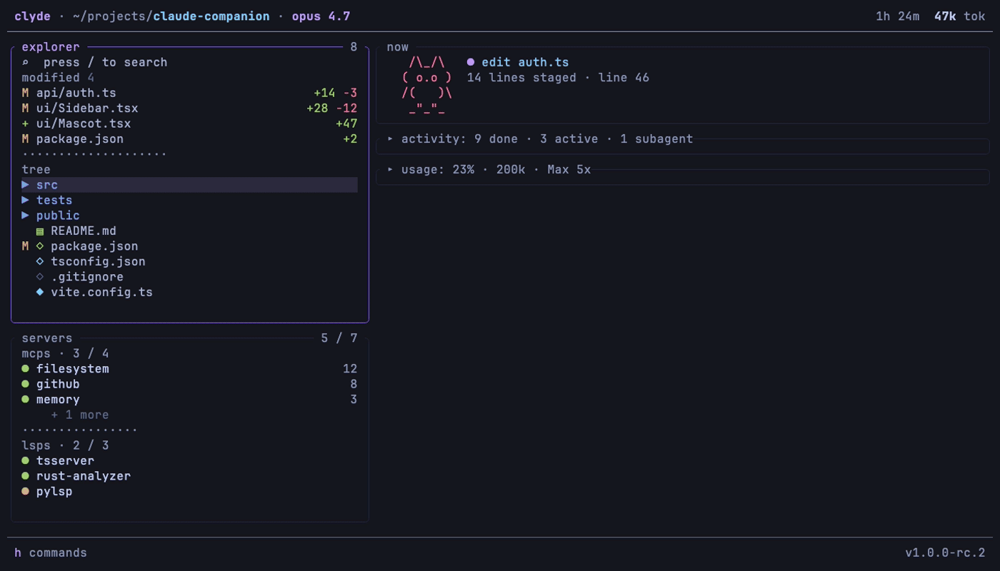
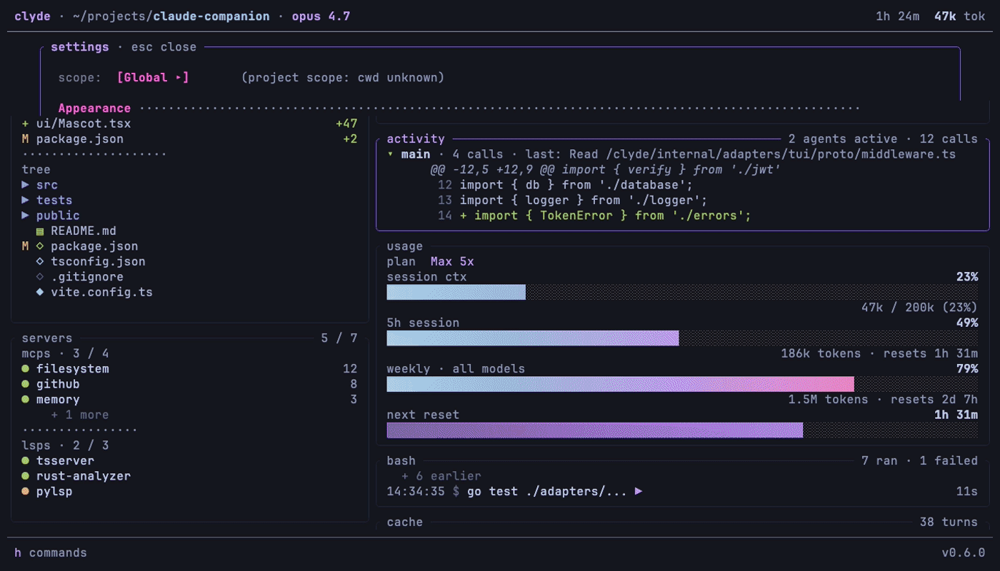

<div align="center">

# Clyde

**Claude's best friend.**

A terminal companion for [Claude Code](https://claude.com/claude-code). Tile it next to your `claude` pane and watch sessions, agents, tokens, diffs, and project state — live, without leaving the terminal.

[](https://github.com/Systemartis/clyde/actions/workflows/ci.yml)
[](https://securityscorecards.dev/viewer/?uri=github.com/Systemartis/clyde)
[](https://goreportcard.com/report/github.com/Systemartis/clyde)
[](https://pkg.go.dev/github.com/Systemartis/clyde)
[](LICENSE)


</div>

---

Claude Code writes everything it does to local JSONL files. Clyde reads them — plus your git tree and `~/.claude` config — and turns them into a live dashboard: which agents are running, what tools they're calling, how much of your plan quota is burning, what changed on disk. Zero configuration, one binary, per-project scope.

```sh
cd your-project     # anywhere you run claude
clyde               # tile it in a side pane (tmux / Zellij / Ghostty / iTerm split)
```

No Claude Code session yet in that directory? Run `clyde --demo` for a deterministic tour on mock data.

## What you get

### 👀 Observability — see what claude is doing, as it does it



- **now** — current operation + an animated mascot that reacts to session state
- **activity** — the agent tree: main session and every subagent, with per-tool calls, durations, and live status
- **usage** — context-window fill, **real plan-quota percentages** for the 5h and weekly windows (same numbers as claude.ai/settings/usage), reset countdowns, burn rate
- **bash** — a ledger of every shell command claude ran, with duration and failures flagged
- **cache** — prompt-cache hit ratio and trend, so you know why a turn was slow or expensive
- **permission requests** — wire up the [hook](#hook-notifications) and approve/deny claude's tool calls from clyde with `y`/`n`
- **session tabs** — multiple claude sessions in one cwd get a tab strip (`[` / `]` to cycle, `Σ` for the aggregate view)

### 🗂 Workspace — stay oriented while claude edits



- **explorer** — file tree with session-modified files highlighted and diffstats, plus fuzzy search (`/`)
- **viewer** — syntax-highlighted file viewer with vim navigation (`j/k`, `gg/G`, `/` + `n/N` find), fullscreen mode (`f`)
- **editor** — press `i` and it's a real editor: selections, clipboard, undo/redo, `:w` / `:q!`, `⌃s` to save
- **diff** — accumulated git hunks for the session (enable it in settings)
- **servers** — the MCP servers and LSPs claude has available, with live status

### 🎨 Customization — make it yours



- **7 themes**, cycled live from the settings overlay: Tokyo Night, Catppuccin, Dracula, Gruvbox, Nord, Rosé Pine, Kanagawa
- **mascot personas** (`meowl`, `bowl`, or `off` — we don't judge)
- **3 layouts**: stack (responsive 1–2 columns), tabs, multi-col (3 columns, ≥160-col terminals) — cycle with `⌃l`
- per-panel toggles, sizes, and collapse defaults — remembered **per project** across restarts
- notification style (fullscreen / banner / off) and a cost-alert threshold

The GIFs above are generated from [`demo/*.tape`](demo/README.md) with [VHS](https://github.com/charmbracelet/vhs) against `clyde --demo` — fully reproducible.

## Install

### One-liner installer (recommended)

```sh
curl -fsSL https://raw.githubusercontent.com/Systemartis/clyde/main/install.sh | sh
```

Detects your OS + arch, fetches the matching archive, verifies the cosign keyless signature (if `cosign` is on `$PATH`), checks the sha256 against `checksums.txt`, and drops the binary into `$HOME/.local/bin`. Override with `INSTALL_DIR=...` or pin a specific tag with `VERSION=v1.0.0-rc.2` (see comments at the top of [`install.sh`](install.sh)).

If you don't have `cosign` installed yet, you'll get a warning that the install proceeded with sha256 verification only. For full supply-chain verification install cosign first (`brew install cosign`) — see [SUPPLY_CHAIN.md](SUPPLY_CHAIN.md).

### Pre-built binaries (manual)

Each release ships a `tar.gz` for `linux/{amd64,arm64}` and `darwin/{amd64,arm64}` plus a `checksums.txt`, an SPDX SBOM per archive, and a cosign signature. See [SUPPLY_CHAIN.md](SUPPLY_CHAIN.md) for the full verify recipe.

```sh
VERSION=1.0.0-rc.2
OS=$(uname -s | tr '[:upper:]' '[:lower:]')
ARCH=$(uname -m | sed 's/x86_64/amd64/;s/aarch64/arm64/')
curl -fsSL "https://github.com/Systemartis/clyde/releases/download/v${VERSION}/clyde_${VERSION}_${OS}_${ARCH}.tar.gz" \
  | tar -xz -C /tmp clyde
install -m 0755 /tmp/clyde "$HOME/.local/bin/clyde"   # or anywhere on $PATH
clyde --version
```

### Build from source (`go install`)

Requires Go 1.26+:

```sh
go install github.com/Systemartis/clyde/cmd/clyde@latest
```

The binary lands at `$(go env GOPATH)/bin/clyde` (typically `~/go/bin/clyde`). Add that to `$PATH` or symlink it somewhere already on it:

```sh
ln -sf "$(go env GOPATH)/bin/clyde" ~/.local/bin/clyde
```

### Windows

There are no native Windows builds yet. Use the `linux/amd64` build under WSL2 — clyde reads `~/.claude` inside the WSL filesystem, so run Claude Code from the same WSL environment.

## Usage

```sh
cd /path/to/your/project        # any directory where you run Claude Code
clyde                           # tile this in a side pane next to `claude`
clyde --demo                    # try it in 10 seconds: deterministic mock data, no live reads
```

| Flag | Default | What it does |
|------|---------|--------------|
| `--demo` | off | Run against deterministic mock data — no live reads, no hook server. Good for a first look and for reproducing UI bugs. |
| `--layout` | from config | Override the layout mode for this run: `stack`, `tabs`, or `multi-col` (3 columns; needs a ≥160-col terminal, otherwise falls back to tabs). |
| `--source` | `claude` | LLM source adapter. Only `claude` ships today; `gemini`/`codex`/`kimi` are planned. |
| `--version` | — | Print the version and exit. |
| `--crash-report` | — | Bundle the log, version, and environment into a tarball at `~/clyde-crash-<timestamp>.tar.gz` for bug reports, then exit. |

Clyde reads real Claude Code session data from `~/.claude/projects/<encoded-cwd>/*.jsonl`. It detects sessions for the current working directory; per-project scope means clyde is intentionally local to the cwd it's launched from. If clyde shows no sessions, confirm you have run `claude` in this directory at least once.

### Plan usage & credentials

On a Pro/Max subscription, the usage panel shows the **same 5-hour and weekly percentages as claude.ai/settings/usage**. To do that, clyde reads the OAuth token Claude Code already stored locally (the macOS Keychain, or Claude Code's credentials file on Linux) and calls the same usage endpoint Claude Code uses. Keychain credentials are treated as strictly read-only — clyde never writes, refreshes, or rotates them.

- On macOS the first live run may show a **Keychain access prompt** — that's clyde reading Claude Code's existing token. Click "Deny" and clyde still works: the plan bars fall back to a time-elapsed approximation derived from your local session files, marked `(plan offline)`.
- API-key users (no subscription) see a `$` cost figure instead of plan bars — per-token cost is the meaningful number there.

### Diagnostics

Clyde logs JSON records to `~/.cache/clyde/clyde.log` (or `$XDG_CACHE_HOME/clyde/clyde.log`). Set `CLYDE_DEBUG=1` to raise the level to debug. When reporting a bug, attach the tarball produced by `clyde --crash-report` — it contains the log, version, and environment, and nothing else.

## Keybindings

The footer always shows `h` — press it for a per-panel cheat-sheet. The essentials:

| Key | Action |
|-----|--------|
| `Tab` / `Shift+Tab` | next / previous panel |
| `↑` `↓` `←` `→` | move focus (column-aware); scroll in active mode |
| `Enter` | expand panel → enter **active mode** (interact with its content, pink border) |
| `Backspace` | leave active mode / collapse |
| `Space` | collapse ⇄ expand (stack layout) |
| `e` `a` `d` `u` `s` `b` `c` | jump to explorer · activity · diff · usage · servers · bash · cache |
| `Ctrl+E` / `Ctrl+A` / `Ctrl+D` | the same jumps, chorded |
| `[` / `]` | previous / next session tab |
| `+` / `-` | resize the active panel (stack layout) |
| `Ctrl+L` | cycle layout mode (stack → tabs → multi-col) |
| `Ctrl+0` | collapse every panel except the focused one |
| `h` | per-panel command cheat-sheet |
| `?` | settings overlay |
| `y` / `n` / `Esc` | allow / deny / dismiss a pending permission request |
| `Ctrl+N` | preview the notification overlay (once per run) |
| `q` / `Ctrl+C` | quit |

**Explorer (active mode):** `↑↓` move the cursor across the modified-files and tree sections, `←→` jump between sections, `Enter` opens a file or toggles a directory, `/` fuzzy-searches the cwd, `gg`/`G` and `⌃d ⌃u ⌃f ⌃b` do what vim taught you, `y`/`Y` copy the full path / basename.

**Viewer:** `j/k` or arrows scroll, `gg`/`G` jump, `/` finds (`n`/`N` between matches), `f` toggles fullscreen, `i` enters the editor, `:` opens command mode (`:w` `:q` `:wq` `:q!`), `⌃s`/`⌘s` saves, `Esc` closes (asks before discarding unsaved edits).

**Editor:** type normally; `Shift`+arrows select, `⌘c`/`⌃c` copy, `⌘a` select-all, `⌘z`/`⌃z` undo, `⌘⇧z`/`⌃y` redo, `⌥`/`⌃`+arrows jump words, `Home`/`End` line edges.

The mouse works too: click to focus, double-click for active mode, wheel to scroll the panel under the cursor, click a panel's top border to collapse it.

## Hook notifications

Clyde can surface Claude Code's **permission requests** as a notification you answer with one keypress — approve or deny tools without switching panes.

How it works: in live mode clyde starts a localhost-only HTTP server on a random free port and writes its URL (which embeds a per-run auth token) to `~/.cache/clyde/hook-url` (mode 0600). A `PreToolUse` hook in Claude Code POSTs each pending tool call to that URL and blocks until you respond.

Add this to `~/.claude/settings.json` (merge with any existing `hooks` block):

```json
{
  "hooks": {
    "PreToolUse": [
      {
        "matcher": "*",
        "hooks": [
          {
            "type": "command",
            "command": "curl -fsS -m 290 -X POST -H 'Content-Type: application/json' -d @- \"$(cat \"${XDG_CACHE_HOME:-$HOME/.cache}\"/clyde/hook-url)\""
          }
        ]
      }
    ]
  }
}
```

Because the command reads `hook-url` at call time, it always finds the current port — no settings edit needed when clyde restarts. `clyde setup` prints this snippet plus your resolved hook-url path on plain stdout.

In the notification: **y** approves, **n** denies, **Esc** denies and dismisses. The design fails closed: if clyde isn't running (curl fails, the hook errors) Claude Code proceeds with its own normal permission prompt, and if clyde's queue is full the call is denied with a retry message rather than silently approved. Pending hooks are auto-denied when you quit clyde.

## Configuration

The global config lives at `~/.config/clyde/config.toml`. Everything is optional — built-in defaults apply, then the global file, then a per-project override section. Most settings can also be changed live from the settings overlay (`?`), and persist back to this file.

```toml
[layout]
default_mode = "stack"            # stack | tabs | multi-col
auto_switch_threshold = 80        # below this terminal width, force stack
cycle_hotkey = "ctrl+l"

# One block per panel: now, calls, diff, usage, explorer, servers, bash, cache.
# position orders panels in the stack; height (optional) pins a row count.
[panels.now]
enabled = true
default_collapsed = false
position = 1

[panels.calls]                    # the "activity" panel
enabled = true
default_collapsed = true
position = 2

[panels.diff]
enabled = false                   # off by default — hunks show inline in activity
default_collapsed = true
position = 3

[panels.bash]                     # opt-in: session-wide bash command ledger
enabled = false

[panels.cache]                    # opt-in: prompt-cache efficiency dashboard
enabled = false

auto_switch_to_all_on_new_session = true   # jump to the Σ tab when a new session appears
remember_layout = false           # persist collapse/resize changes across runs (per project)
notification_style = "fullscreen" # fullscreen | banner | off
notify_cost_threshold_usd = 20.0  # 0 disables cost alerts (plan-quota alerts still fire)
theme = "tokyo-night"             # tokyo-night | catppuccin | dracula | gruvbox | nord | rose-pine | kanagawa
mascot_persona = "meowl"          # meowl | bowl | off
boot_screen_enabled = true

# Per-project overrides (applied last, keyed by absolute cwd).
[projects."/Users/you/work/api".panels]
diff = true
bash = true
```

## Privacy & trust model

Clyde is a **local observer**. It reads files Claude Code already writes on your machine (`~/.claude/projects`, `~/.claude/todos`, `~/.claude/settings.json`), your project's `.git`, and — only for the plan-usage percentages — calls Anthropic's usage endpoint with the credentials Claude Code already stored. No telemetry, no analytics, no network calls beyond that one optional endpoint. Logs stay in `~/.cache/clyde/`. See [SECURITY.md](SECURITY.md) for the full trust model and disclosure process.

## Stack

- **Go** + [`charm.land/bubbletea/v2`](https://charm.land) + `lipgloss/v2` — single static binary.
- **Hexagonal layering**: `internal/domain` (pure stdlib) / `internal/application` (use cases) / `internal/ports` (interfaces) / `internal/adapters/*` (see the directory — every adapter is wired in `cmd/clyde/main.go`).
- **Strict TDD**: failing test → implement → green → refactor. Domain and application use table-driven tests; TUI uses `teatest/v2` golden snapshots.
- **Lint enforcement**: `golangci-lint` `depguard` rules in `.golangci.yml` reject layering violations (domain → adapters/UI, application → adapters, ports → adapters).

## Development

```sh
go test ./...                 # unit + integration tests
go test -race ./...           # what CI runs
go vet ./...                  # static checks
gofmt -l .                    # formatting (no diff = clean)
golangci-lint run ./...       # lint + hexagonal layer enforcement
go build ./cmd/clyde          # local build
go run ./cmd/clyde --demo
```

See [CONTRIBUTING.md](CONTRIBUTING.md) for the local-dev setup, the strict-TDD requirement, and the conventional-commits + branch-naming rules.

## Uninstall

```sh
rm "$(which clyde)"                                  # the binary (~/.local/bin/clyde or ~/go/bin/clyde)
rm -rf ~/.cache/clyde                                # log + hook-url (or $XDG_CACHE_HOME/clyde)
rm -rf ~/.config/clyde                               # config.toml
```

If you added the hook snippet, also remove the clyde entry from `hooks.PreToolUse` in `~/.claude/settings.json`.

## Security

Found a vulnerability? Please **don't** open a public issue. See [SECURITY.md](SECURITY.md) for the disclosure process and trust model. Each tagged release ships SPDX SBOMs and a keyless cosign signature over `checksums.txt` — verify before running.

## Governance

[GOVERNANCE.md](GOVERNANCE.md) describes how decisions get made and who holds the keys; [MAINTAINERS.md](MAINTAINERS.md) lists the current crew.

## License

Open source under the **MIT License** — see [LICENSE](LICENSE). Copyright © 2026 Systemartis, Vlad Popescu-Bejat, Maxim Tudor Maicovschi. Free to use, modify, and redistribute; attribution required per the license terms.

## Trademarks

**Clyde** and the visual identity are trademarks of [Systemartis](https://systemartis.com). The MIT license covers the source code; it does not grant rights to the name or branding. Forks are welcome — please pick a different name.

**Claude** and **Claude Code** are trademarks of [Anthropic, PBC](https://www.anthropic.com). This project is not affiliated with, endorsed by, or sponsored by Anthropic. Clyde is a third-party companion that reads files Claude Code writes locally; it is not a client of any Anthropic API on its own (the optional plan-usage check uses the same credentials Claude Code already wrote to your Keychain).
